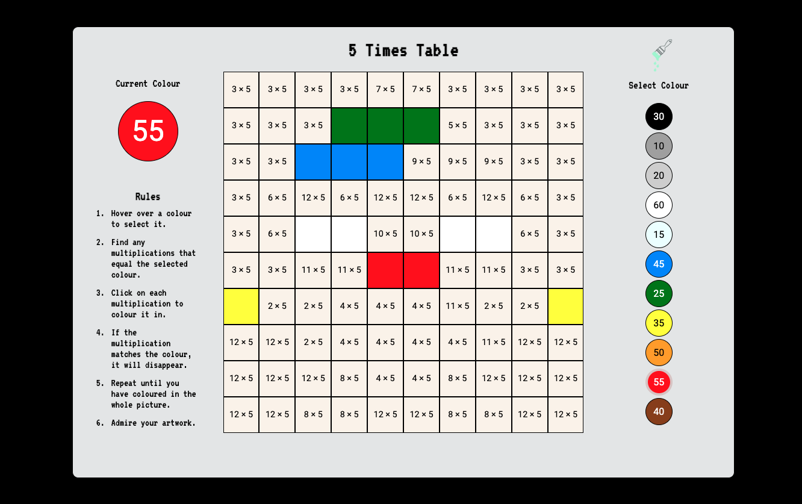
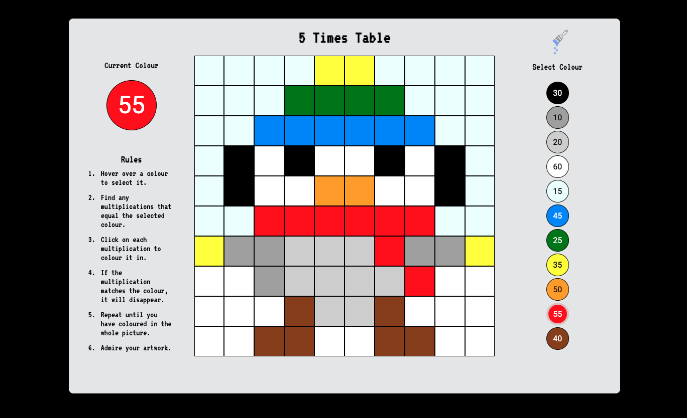

# Pixel Art - Maths Learning Game

A prototype for a game to teach times tables.
Paint the squares with the corresponding colour to match the multiplication.
Reveal a 10 x 10 pixel art image.

## View

View demo [here](url)

## Notes

Replaced the cursor with a png of a paintbrush that changes colour depending on the current selected paint. There is a webkit browser issue that the cursor image only updates on mousemove. This is a well documented issue. Trying to find a solution. One option is to assign the current paint and cursor image on onMouseOver rather than onMouseDown. But I feel that clicking to choose the paint is more important for UX.

